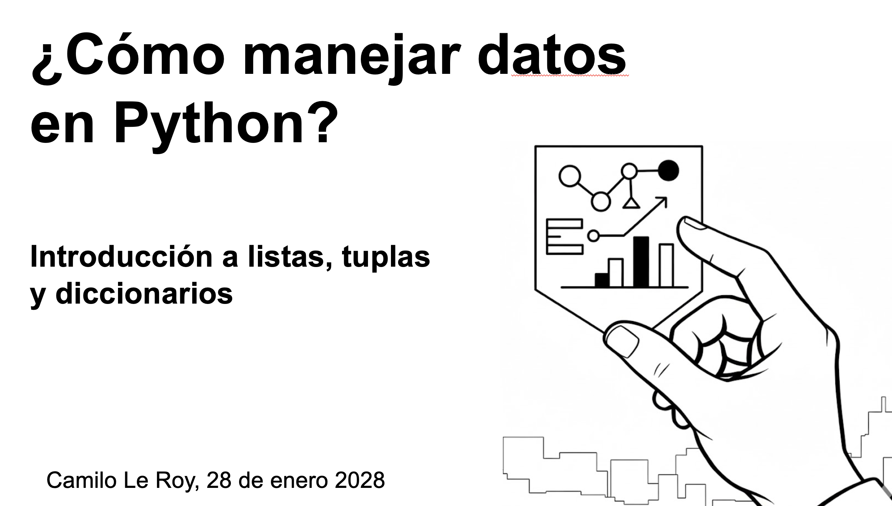

# Estructuras de Datos Básica en Python  
**Listas, Tuplas y Diccionarios**

Este repositorio contiene el material del curso **“Estructuras de datos básicas en Python”**.

En este curso aprenderás:
- qué son las listas, tuplas y diccionarios  
- cuándo usar cada estructura  
- cómo acceder y manejar datos en Python  

---

## Curso en video

---

## [Notebook con el código](Como_manejar_datos_en_Python.ipynb)
Contiene todo el código usado en el video para que puedas practicar y probarlo por tu cuenta.

---

## [Quiz teórico](Reto de Python, Listas, Tuplas y Diccionarios.pdf)
Un quiz en PDF para comprobar que entendiste los conceptos.

---

## [Ejercicio práctico](Proyecto_Sistema_de_gestion_de_pedidos.ipynb)
Un notebook con un ejercicio para aplicar lo aprendido.

